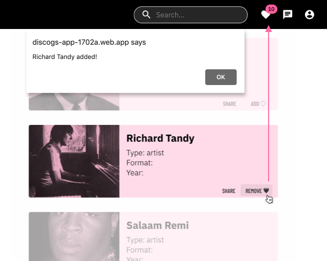

### Discogs App made with React

🌐 https://discogs-app-1702a.web.app/

The discogs-app is a progressive web app that provides a basic search and bookmark function for the user. It improved and simplified the user interface, yet kept the core functions of discogs.com

## Features
Enter your search in the searchbar and get results from the world's largest musis database! 
You can use the bottom tabs to further filter your results.

 
 

You can register an account with your Emaii and username. With an account, you can save artists, bands or albums that you like to your Favorite list. You saved-list update will be shown at the top bar counter badge. (see below) 

## Approach

React Context API  
React Router Dom   
Asynchronous Javascript -AJAX  
Responsive Web Design  

## Tools,Framework

Firebase   
Google Oauth  
Material UI  
React Device Detect  

## Resources

Discogs API   
https://www.discogs.com/developers/#   

## Learn More

You can learn more in the [Create React App documentation](https://facebook.github.io/create-react-app/docs/getting-started).

To learn React, check out the [React documentation](https://reactjs.org/).
